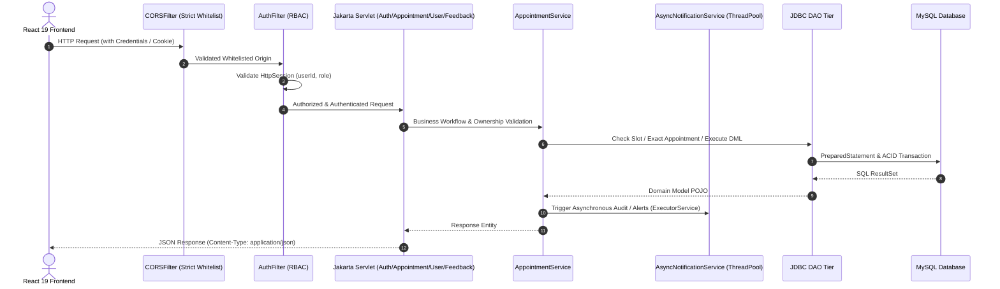

# MediCare Healthcare Management System — Java Web Backend

## Phase 1, 2, 2.2 & 2.3: Enterprise Jakarta Servlet & JDBC Architecture

This module implements the Java Enterprise backend foundation for the MediCare Online Healthcare Management System, compliant with the University **Java Web Based Projects Marking Rubric**.

---

## 1. System Architecture & Request Lifecycle

---

## 2. Servlet Endpoints & Access Control Matrix

| Servlet | Path Pattern | HTTP Method | Protected | Role Required | Access Policy |
| :--- | :--- | :---: | :---: | :---: | :--- |
| **AuthServlet** | `/api/auth/login` | `POST` | No | Public | Authenticates credentials with PBKDF2; rejects legacy plaintext. |
| | `/api/auth/logout` | `POST` | Yes | Any | Invalidates active `HttpSession`. |
| | `/api/auth/session` | `GET` | Yes | Any | Returns current authenticated user profile. |
| | `/api/auth/register` | `POST` | No | Public | Registers Patient or Doctor (blocks `ADMIN` role creation). |
| **AppointmentServlet** | `/api/appointments` | `GET` | Yes | Any | Returns role-filtered appointments (`Patient`, `Doctor`, or `Admin`). |
| | `/api/appointments/patient`| `GET` | Yes | Patient / Admin | Returns patient appointments. |
| | `/api/appointments/doctor` | `GET` | Yes | Doctor / Admin | Returns doctor appointments. |
| | `/api/appointments/admin`  | `GET` | Yes | Admin | Returns all appointments across the system. |
| | `/api/appointments/{id}`   | `GET` | Yes | Any Authorized | Owner verification: Patient (own), Doctor (assigned), Admin (all). |
| | `/api/appointments`        | `POST` | Yes | Patient / Admin | Books appointment; Patient ID strictly bound to session. |
| | `/api/appointments/{id}/reschedule` | `PUT` | Yes | Patient / Admin | Reschedule permitted only for owning patient or admin. |
| | `/api/appointments/{id}/status` | `PUT` | Yes | Doctor / Admin | Status update permitted only for assigned doctor or admin. |
| | `/api/appointments/{id}`   | `DELETE` | Yes | Any Authorized | Cancellation permitted only for owning patient, doctor, or admin. |
| **UserServlet** | `/api/users` | `GET` | Yes | Admin | Lists all users. |
| | `/api/users/doctors` | `GET` | Yes | Any | Lists doctors with ratings and specializations. |
| | `/api/users/patients` | `GET` | Yes | Doctor / Admin | Lists registered patients. |
| | `/api/users/{id}` | `GET`, `PUT` | Yes | Self / Admin | Strict profile isolation: Non-admins can only view/edit own profile. |
| | `/api/users/{id}` | `DELETE` | Yes | Admin | Deletes user account. |
| | `/api/users/doctors/{id}/approve` | `PUT` | Yes | Admin | Approves doctor registration and prevents duplicate notices. |
| | `/api/users/doctors/{id}/reject` | `PUT` | Yes | Admin | Rejects doctor registration. |
| **NotificationServlet** | `/api/notifications` | `GET` | Yes | Any | Retrieves notifications strictly for authenticated user. |
| | `/api/notifications/{id}/read` | `PUT` | Yes | Any | Marks notification read only if matching `session.userId`. |
| | `/api/notifications/read-all` | `PUT` | Yes | Any | Marks all notifications for user as read. |
| **MedicalRecordServlet**| `/api/medical-records` | `GET` | Yes | Any Authorized | Clinical access policy: Doctor access requires a COMPLETED consultation. UPCOMING and CANCELLED bookings disallowed. |
| | `/api/medical-records` | `POST` | Yes | Doctor / Admin | Files new medical record and notifies patient. |
| **FeedbackServlet** | `/api/feedback` | `GET` | Yes | Any | Queries doctor or patient feedback (Admin calls `findAll()`). |
| | `/api/feedback` | `POST` | Yes | Patient ONLY | Strictly Patient-only. Validates exact appointment (patient, doctor, status == COMPLETED, unique appointment_id). |
| **AnalyticsServlet** | `/api/analytics/overview` | `GET` | Yes | Admin | Dynamic aggregation directly from database tables. |

---

## 3. Feedback & Clinical Access Policies (Phase 2.3)

1. **Patient-Only Feedback with Exact Appointment Verification:**
   - Feedback submission is restricted exclusively to `Role.PATIENT` (Admins and Doctors receive `HTTP 403 Forbidden`).
   - The submission requires an explicit `appointmentId`. The backend verifies that the appointment exists, belongs to the session patient, was conducted with the requested doctor, and is in `COMPLETED` status.
   - Duplicate feedback submissions for the same `appointment_id` are detected via SQL (`SELECT COUNT(*) FROM feedback WHERE appointment_id = ?`) and rejected with `HTTP 409 Conflict`.
2. **Doctor Access to Medical Records:**
   - A doctor may view or create medical records for a patient only if there is a `COMPLETED` clinical consultation.
   - `UPCOMING` and `CANCELLED` appointments do not grant access to medical records.
3. **Database Schema:**
   - `feedback.appointment_id` is stored as a foreign key (`UNIQUE`) referencing `appointments(id)`.
